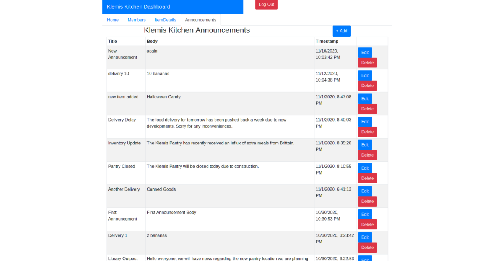

# Klemis Kitchen Admin Dashboard
`Klemis Kitchen Admin Dashboard` is a React web app allowing Klemis Kitchen administrators to handle different administrative tasks related to the `Klemis Kitchen App`.  
Created as part of Georgia Tech’s Junior Design class in collaboration with Klemis Kitchen.  
\


## 📝 Release Notes
Version 1.0  
New Features: Home Screen, Members, Locations, Item Details, and Announcements pages  
Known Bugs: The Item Details table extends past the normal window size, and when uploading images, if the upload is canceled, the picture is uploaded to S3 but then lost forever, taking up unnecessary space  

## 🚀 Usage
The dashboard will soon be available at [dashboard.klemis-kitchen.com](dashboard.klemis-kitchen.com)
 for authorized users. Alternatively, this application can be run locally by cloning the project from GitHub, and installing both `node.js` and `yarn`. Then, by using the command line or an equivalent, use 
```
yarn install
yarn start
```
within the project directory. This will cause the application to open in the default browser.


## 🔧 Configuration
The default (production) configuration of the app points to `api.klemis-kitchen.com` to retrieve pantry information from. This server runs `Klemis Kitchen API` on a Georgia Tech-hosted platform.  
To change where to fetch data from, edit `APIFETCHLOCATION` in `constants.tsx`

## ⛑️ Troubleshooting/FAQ
"I clicked on the login button, and nothing happened": The API may be down. Waiting 5-10 minutes and trying again may fix the issue.  
"I'm running the API locally, and when running the app in the browser nothing happens": You may be getting CORS errors. To fix this, you'll need to disable CORS Security measures in your browser either by getting the "CORS Everywhere" extension for Firefox or by running Chromium from the command line with the disable-web-security flag. Note that this is not recommended due to opening your browser up to attacks, so follow advice at your own risk.  
"I'm running the API locally, and after doing the above, I see results from the remote server": Make sure you've followed the instructions under the "Configuration" section of the guide.  
"I put in my login credentials and got an error": The Admin Dashboard is only available to administrators. Make sure you have the correct credentials and try again.
